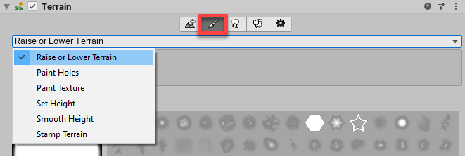
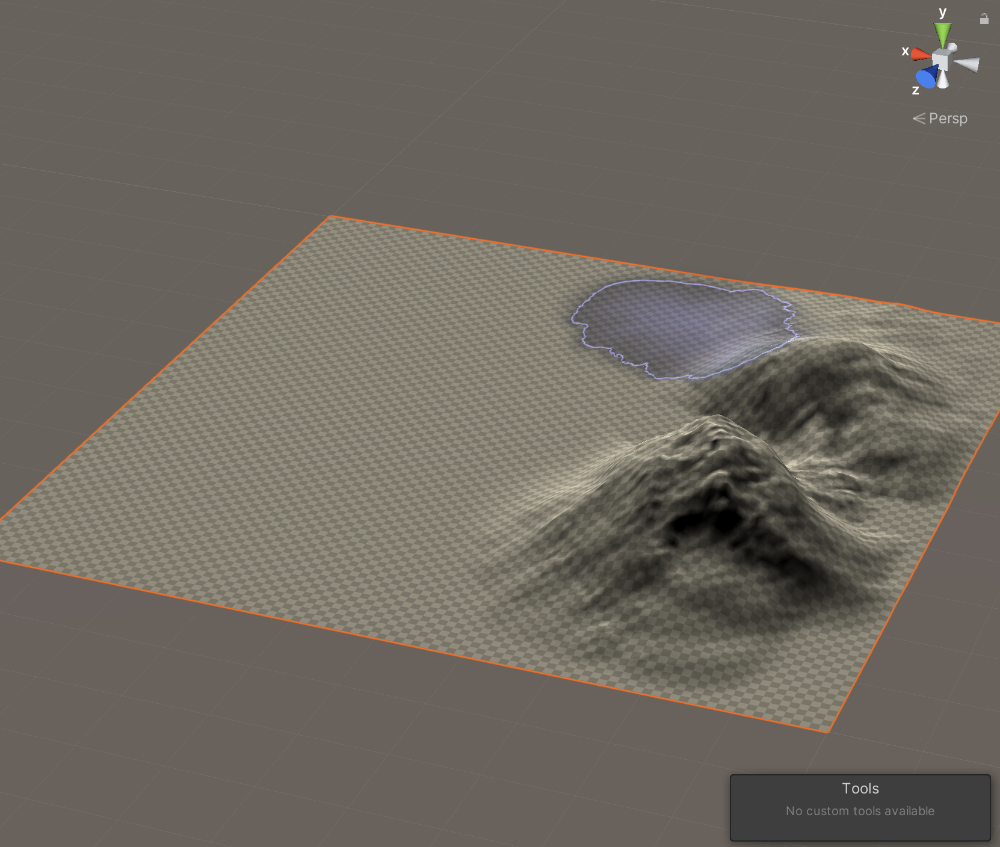
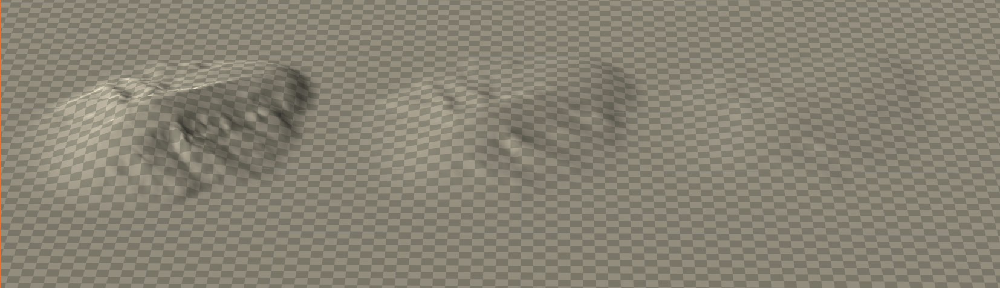

# 2020_Winter_Hae_U

## Terrain
Terrain은 게임 내의 풍경을 마음대로 만들 수 있는 Unity의 내장 툴입니다. 

 이 툴은 편리하며, Asset Store에서 다양한 asset들을 무료로 다운로드 받을 수도 있습니다. 하지만 메모리를 많이 사용하기 때문에 게임이 느려질 수 있습니다. 

Terrain을 생성해봅시다!

> GameObject > 3D Object > Terrain   
>    
> Terrain 컴포넌트에서는 Terrain을 제작할 수 있습니다. 또한 생성된 오브젝트의 정보는 Asset 폴더에 저장됩니다.    
> Terrain Collider 컴포넌트는 Terrain의 높낮이 생김새대로 충돌처리를 할 수 있습니다.


Terrain이 너무 크면 카메라로 보기 힘들기 때문에 미리 크기를 줄여주겠습니다.   
> .   
>  Terrain Height는 현재 지형의 높이를 설정하는 것이 아니고 생성한 지형의 최대 높이를 의미합니다.
   
   
Terrain 컴포넌트의 메뉴들을 살펴봅시다.   
> .
> 1. Create Neighbor Terrains:      
> 인접한 Terrain 타일 만들기   
> 2. Paint Terrain:   
> Terrain에 지형 텍스처를 입히고,  브러쉬로 높낮이를 조절할 수 있는 메뉴   
> 3. Paint Trees   
> Unity에 내장된 Tree Object를 생성하여 나만의 나무 Prefab을 생성해서 입힐 수도 있고, 일반 Object를 Terrain을 배치할 수도 있다.
> 4. Paint Details   
> 주로 풀, 돌을 심는데 사용하며,  지형 지물을 심을 때 사용한다.
>5. Terrain Settings   
>현재 선택한 Terrain Object의 설정값을 조정할 수 있다. Terrain의 해상도, 크기, 풀에 적용되는 바람의 세기등을 조절할 수 있다.

메뉴를 살펴보기 전, Unity에 내장된 브러쉬가 몇개 없어서, Asset Store에서 무료 Asset들을 다운로드 받겠습니다. 나무와, 지형지물을 생성할 수 있는 브러쉬입니다. 

> .
> .

이외에도 도시, SF, 자연 등 게임 컨셉에 맞는 Asset들을 편리하게 다운로드 받을 수 있으니 필요에 맞게 Asset Store을 이용하면 됩니다.


**1. Create Neighbor Terrains**  
.    
 이웃 Terrain을 만들어 지형의 크기를 늘려 줍니다. 이웃 네방향으로 새로운 Terrain을 생성할 수 있습니다.
Fill Heightmap Addre의 Clamp 모드와 Mirror 모드에 대해서는 브러쉬로 지형을 어느정도 생성한 후  설명하도록 하겠습니다. 우선 네개의 인접 Terrain을 생성합니다.

**2. Paint Terrain**    

.

 - Raise or Lower Terrain    
 Brush 정보를 바탕으로 Terrain의 높낮이를 바꿉니다. 


>
> 
> .          

마우스 좌클릭으로 Terrain을 높이고,   
Shift 좌클릭으로 Terrain의 높이를 브러쉬 모양대로 낮출 수 있습니다.


 Terrain 키보드 단축키
| 단축키 | 기능 |
|--|--|
| - 와 =  | 브러쉬의 불투명도 조절 |
|[ 와 ] | 브러쉬의 크기 조절|
| , 와 . | 브러쉬의 모양을 순환하며 바꿔줌   
   
> .      
> opacity를 각각 100, 50, 20으로 조절한 결과입니다.

 - Paint Holes    
 Terrain의 일부를 숨기거나, Shift 마우스 키로 다시 원상복구 할 수 있습니다.
> .      
> .      

- Paint Texture   
 > .      
 Asset store에서 다운로드 받은 레이어 하나를 불러옵니다.   
 > .      
 선택한 레이어의 형태로 터레인 전체가 물든 것을 볼 수 있습니다.    
> .      
레이어 항목들 중 맨 앞에 있는 것이 터레인 전체에 적용되고, 이 후에 추가한 레이어들은 브러쉬에 적용하여 터레인을 채색할 수 있습니다.    
> .      
Normal Scale을 조절하여 맵의 선명도를 낮추어 자연스럽게 만들 수 있고, x,y를 조절하면 바둑판 배열이 더 촘촘해져 미관상 더 보기 좋게 모양이 만들어 집니다.    
> .      


 - Set Height   
  설정한 Height 대로 지형값을 조정하는 기능입니다.
  > .      
  > 이를 이용해서 평평한 언덕을 만들기 좋습니다.    

 - Smooth Height   
설정한 브러쉬 모양으로 울퉁불퉁한 지형을 매끄럽게 할 수 있습니다.
> .      
 - Stamp Terrain   
 설정한 브러쉬 모양과 높이대로 한번에 스탬프처럼 지형 모양을 찍을 수 있습니다. 
> .      
> Max <--> add 를 1로 설정하면 stamp의 height 위에 stamp를 덧붙여 찍을 수 있고, 0으로 설정하면 Stamp height 이상으로 지형이 높아질 수 없습니다.

**3. Paint Trees**    
> .      
> 다운로드 받았던 나무 에셋을 적용시킬 수도 있고,    
> 
> .       
> 3D object를 생성하여 나무를 커스터마이징 할 수도 있습니다.


**4. Paint Details**   
마지막으로 풀을 생성해 보겠습니다. 
> .      
> 정말 단순한 그림 만으로도, 풀은 자연스럽게 표시가 되기 때문에, 직접 그린 풀 텍스처를 png파일로 저장하여, 에셋 폴더에 넣고 grass texture object에 적용 시키겠습니다.    
> .     
> 카메라의 위치를 잘 조정해주면, 게임화면에서의 풀이 이런식으로 보이게 됩니다.   
> .      
> 게임을 실행하면 풀이 바람에 날리는 모습을 볼 수 있습니다. 꽤 그럴듯하죠?     
> Terrain setting에서 풀에 적용되는 바람에 대한 설정을 할 수도 있습니다.

  
    


     

빈 공간에 Capsule과 Plane을 만듭니다.

> rename : Capsule -> Player
> rname : Plane -> Ground

 Camera를 조정하여 플레이어를 위에서 비스듬히 내려다 볼 수 있게 세팅을 완료합니다.
>   **단축키**
> Q : 화면 이동 or 마우스 휠 클릭
> W : Object 이동
> (빨간선 : x축, 초록선 : y축, 파란선 : z축)
> 
> E : Object 회전
> 
> R : 오브젝트 크기 조절
> 
> T : 오브젝트 평면 크기 조절
> 
<br>


PlayerMoveController.cs 스크립트를 만들고 Player에게 적용시킵니다.


```C#
using System.Collections;
using System.Collections.Generic;
using UnityEngine;

public class PlayerMoveController : MonoBehaviour
{
    public float h;
    public float v;

    public float playerSpeed = 5.0f;

    public Vector3 dir;

    private void Update()
    {
        h = Input.GetAxis("Horizontal");
        v = Input.GetAxis("Vertical");

        dir = h * Vector3.back + v * Vector3.right;

        this.transform.Translate(dir * playerSpeed * Time.deltaTime);
    }

}

```

플레이어를 따라가게하는 CameraController.cs 스크립트 또한 만들고, Main camera에 적용시킵니다.

```C#
using System.Collections;
using System.Collections.Generic;
using UnityEngine;

public class CameraController : MonoBehaviour
{
    public float cameraSpeed = 1.0f;
    public GameObject player;

    public Vector3 dir;
    public Vector3 offset;

    private void Start()
    {
        offset = player.transform.position - this.transform.position;
    }
    private void Update()
    {
        dir = player.transform.position - this.transform.position - offset;

        this.transform.Translate(dir * cameraSpeed * Time.deltaTime, Space.World);
    }
}
```

카메라가 플레이어를 잘 따라가는지 확인해봅니다.

-> cameraSpeed를 Inspector상에서 조정함으로서 게임 중에 적절한 카메라 속도를 찾을 수 있습니다.


