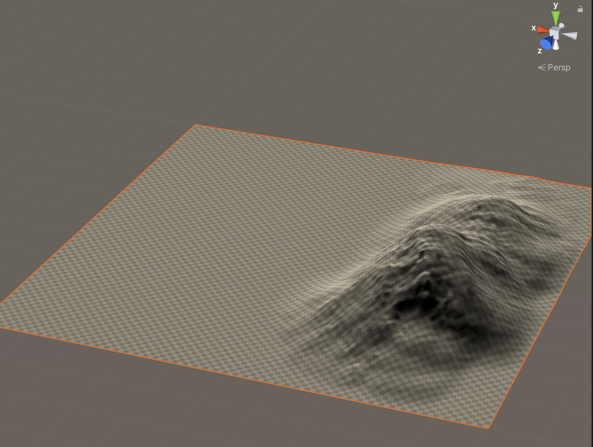
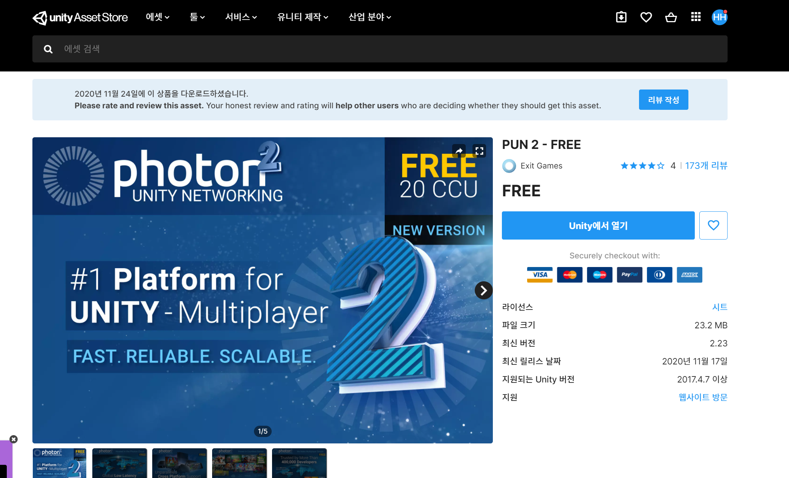
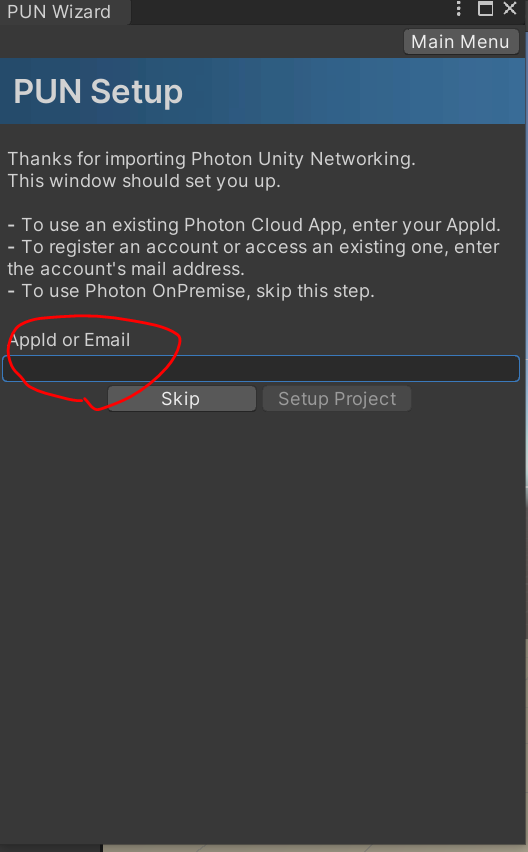
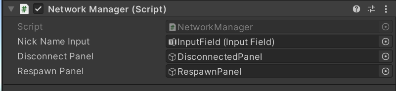

# 2020_Winter_Hae_U

Terrain에 대해 배워봅시다.

Terrain은 지형,나무,잔디등의 풍경을 만드는 내장 셋입니다.    

> GameObject > 3D Object > Terrain
> 
> 
> 1. 인접한 Terrain 타일 만들기
> 2. Terrain을 만들고 페인팅
> 3. 나무
> 4. 풀,꽃,돌
> 5. Terrain 설정

Terrain 키보드 단축기
> - , 와 . : 브러쉬를 좌,우로 순환하며 바꿔줌
> - [ 와 ] : 브러쉬 크기 조절
> - &#45; 와 = : 브러쉬의 불투명도 조절  

</br>
1. 이웃 Terrain을 만들어 지형의 크기를 늘려줍니다.  
</br>

> 
> 

//clamp와 mirror의 차이
//Terrain설정에서 타일간연결해제    

> 
1. Raise or Lower Terrain : 페인트 툴
2. Paint Holes : 터레인의 일부를 숨김 
3. Set Height : 하이트맵을 특정 값으로 조정
4. Smooth Height: 지형 매끄럽게
5. Stamp Terrain : 지형에 스탬프    


마우스 좌클릭 : 지형 높이 상승   
마우스 좌클릭 + Shift : 지형 높이 하강   
> 
   
      

Terrain 최대 높이 조절
> 
> 


     

빈 공간에 Capsule과 Plane을 만듭니다.

> rename : Capsule -> Player
> rname : Plane -> Ground

 Camera를 조정하여 플레이어를 위에서 비스듬히 내려다 볼 수 있게 세팅을 완료합니다.

>   **단축키**
> Q : 화면 이동 or 마우스 휠 클릭
> W : Object 이동
> (빨간선 : x축, 초록선 : y축, 파란선 : z축)
>   
> E : Object 회전
>   
> R : 오브젝트 크기 조절
>   
> T : 오브젝트 평면 크기 조절
>   
<br>


PlayerMoveController.cs 스크립트를 만들고 Player에게 적용시킵니다.

  

```C#
using System.Collections;
using System.Collections.Generic;
using UnityEngine;

public class PlayerMoveController : MonoBehaviour
{
    public float h;
    public float v;

    public float playerSpeed = 5.0f;

    public Vector3 dir;

    private void Update()
    {
        h = Input.GetAxis("Horizontal");
        v = Input.GetAxis("Vertical");

        dir = h * Vector3.back + v * Vector3.right;

        this.transform.Translate(dir * playerSpeed * Time.deltaTime);
    }

}

```

플레이어를 따라가게하는 CameraController.cs 스크립트 또한 만들고, Main camera에 적용시킵니다.

```C#
using System.Collections;
using System.Collections.Generic;
using UnityEngine;

public class CameraController : MonoBehaviour
{
    public float cameraSpeed = 1.0f;
    public GameObject player;

    public Vector3 dir;
    public Vector3 offset;

    private void Start()
    {
        offset = player.transform.position - this.transform.position;
    }
    private void Update()
    {
        dir = player.transform.position - this.transform.position - offset;

        this.transform.Translate(dir * cameraSpeed * Time.deltaTime, Space.World);
    }
}
```

카메라가 플레이어를 잘 따라가는지 확인해봅니다.

-> cameraSpeed를 Inspector상에서 조정함으로서 게임 중에 적절한 카메라 속도를 찾을 수 있습니다.

  

>   참고 : "Horizontal"값과 "Vertical"값은 유니티 내에서 매크로로 정해두고 있는 값입니다. (Edit->Project Setting)
  

Player에게 간단한 얼굴을 만들어 줬습니다.


RigidBody와 Capsule Collider 컴포넌트를 추가해 줍니다.


<br><br><br>

But,
-> 캐릭터가 넘어지는 상황 발생 !


Freeze Rotation 기능을 활용하여 일단 넘어지지 않게 설정해줍니다.


### Jump 구현

다음과 같이 코드를 먼저 '추상화'시켜줍시다

```C#
using System.Collections;
using System.Collections.Generic;
using UnityEngine;

public class PlayerMoveController : MonoBehaviour
{
    public float h;
    public float v;

    public float playerSpeed = 5.0f;

    public Vector3 dir;

    private void Update()
    {
        Move();

        Jump();
    }

    void Move()
    {
        h = Input.GetAxis("Horizontal");
        v = Input.GetAxis("Vertical");

        dir = h * Vector3.back + v * Vector3.right;

        this.transform.Translate(dir * playerSpeed * Time.deltaTime);
    }

    void Jump()
    {

    }

}

```

우선, 아래와 같이 코드를 수정해줍니다.


```C#
using System.Collections;
using System.Collections.Generic;
using UnityEngine;

public class PlayerMoveController : MonoBehaviour
{
    public float h;
    public float v;
    
    public float playerSpeed = 5.0f;
    public float playerJumpPower = 5.0f;
    public Rigidbody rigid;

    public Vector3 dir;


    private void Start()
    {
        rigid = this.GetComponent<Rigidbody>();
    }

    private void Update()
    {
        Move();
        Jump();
    }

    void Move()
    {
        h = Input.GetAxis("Horizontal");
        v = Input.GetAxis("Vertical");

        dir = h * Vector3.back + v * Vector3.right;

        this.transform.Translate(dir * playerSpeed * Time.deltaTime);
    }

    void Jump()
    {
        if (Input.GetKeyDown(KeyCode.Space))
        {
            Debug.Log("jump");
            rigid.AddForce(Vector3.up * playerJumpPower, ForceMode.Impulse);
        }
    }
}

```


문제점 : SPACE 키를 누를때마다 점프를 계속 한다.

해결법 : isjumping이란 bool형 변수를 추가하여 1번만 점프할 수 있게 한다.

-> ground와 충돌을 감별할 수 있어야하므로 ground에도 rigidbody와 collider를 추가해준다.


이후 ground의 Mesh collider 속성을 없애준다. (충돌이 일어나기때문)

아래의 Jump scripts 작성

```c#
using System.Collections;
using System.Collections.Generic;
using UnityEngine;

public class PlayerMoveController : MonoBehaviour
{
    public float h;
    public float v;
    
    public float playerSpeed = 5.0f;
    public float playerJumpPower = 5.0f;

    public bool isjumping = false;

    public Rigidbody rigid;

    public Vector3 dir;


    private void Start()
    {
        rigid = this.GetComponent<Rigidbody>();
    }

    private void Update()
    {
        Move();
        Jump();
    }

    void Move()
    {
        h = Input.GetAxis("Horizontal");
        v = Input.GetAxis("Vertical");

        dir = h * Vector3.back + v * Vector3.right;

        this.transform.Translate(dir * playerSpeed * Time.deltaTime);
    }

    void Jump()
    {
        if (Input.GetKeyDown(KeyCode.Space) && isjumping == false)
        {
            Debug.Log("jump");
            rigid.AddForce(Vector3.up * playerJumpPower, ForceMode.Impulse);
            isjumping = true;
        }
    }

    private void OnCollisionEnter(Collision collision)
    {
        if (collision.gameObject.CompareTag("ground"))
        {
            isjumping = false;
        }
    }
}

```


점프 스크립트가 잘 작동하는 것을 확인할 수 있습니다..

이후 Assets 폴더 안에 Prefebs 폴더를 만들고,

Player Object를 넣어줍니다.


## 서버 개발 (Photon 2 PUN)

패키지 매니저에서 Photon2 PUN(free)을 다운받고, 유니티에 Import 해줍니다.



photon 홈페이지에 가입하고, 다음과같이 새로운 어플리케이션을 만들어 줍니다.


만들어진 Id를 Photon setting에 넣어줘서 고유 ID값을 활성화시켜줍니다.  



다음과 같이 UI를 만들어 줍니다.


UI 구성요소는 다음과 같습니다. (DisconnectedPanel)


같은 방식으로 RespawnPanel또한 만들어줍니다.


빈 오브젝트를 만들고, 이름을 NetworkManager라고 Rename한 다음,

C# 스크립트를 만들고 다음 코드를 입력합니다.

```C#
using System.Collections;
using System.Collections.Generic;
using UnityEngine;

using Photon.Pun;
using Photon.Realtime;
using UnityEngine.UI;

public class NetworkManager : MonoBehaviourPunCallbacks
{
    public InputField NickNameInput;
    public GameObject DisconnectPanel;
    public GameObject RespawnPanel;

    private void Awake()
    {
        Screen.SetResolution(960, 540, false);
        PhotonNetwork.SendRate = 60;
        PhotonNetwork.SerializationRate = 30;
    }

    public void Connect() => PhotonNetwork.ConnectUsingSettings();

    public override void OnConnectedToMaster()
    {
        PhotonNetwork.LocalPlayer.NickName = NickNameInput.text;
        PhotonNetwork.JoinOrCreateRoom("Room", new RoomOptions { MaxPlayers = 6 }, null);
    }

    private void Update()
    {
        if(Input.GetKeyDown(KeyCode.Escape) && PhotonNetwork.IsConnected)
        {
            PhotonNetwork.Disconnect();
        }
    }

    public override void OnJoinedRoom()
    {
        DisconnectPanel.SetActive(false);
    }

    public override void OnDisconnected(DisconnectCause cause)
    {
        PhotonNetwork.LocalPlayer.NickName = " ";
        DisconnectPanel.SetActive(true);
        RespawnPanel.SetActive(false);
    }


}

```

Network Manager 스크립트의 Inspector창에 다음과 같이 Object들을 할당해 줍니다.



플레이어 위에 UI 하나 만들어주고, Nickname이 들어갈 텍스트를 하나 만들어줍니다.


outline component 등을 이용해 예쁘게 꾸며줍니다.


플레이어에 PhotonView 스크립트 컴포넌트를 추가해둡니다. (서버 동기화를 위해)


또한, PhotonRigidbody View 를 추가하여 Photon View쪽에 추가해주면 됩니다.


플레이어 움직임 c# 스크립트를 다음과 같이 작성합니다.

```c#
using System.Collections;
using System.Collections.Generic;
using UnityEngine;
using UnityEngine.UI;

using Photon.Pun;
using Photon.Realtime;

public class PlayerMoveController : MonoBehaviourPunCallbacks, IPunObservable
{
    public float h;
    public float v;
    
    public float playerSpeed = 5.0f;
    public float playerJumpPower = 5.0f;
    public float cameraSpeed = 8.0f;

    public bool isjumping = false;

    public Rigidbody rigid;
    public Vector3 dir;

    public Text NickNameText;
    public PhotonView PV;
    public GameObject cam;
    public Vector3 offset = Vector3.zero;

    void Awake()
    {

        NickNameText.text = PV.IsMine ? PhotonNetwork.NickName : PV.Owner.NickName;
        NickNameText.color = PV.IsMine ? Color.green : Color.red;
    }

    private void Start()
    {
        rigid = this.GetComponent<Rigidbody>();

        if (!photonView.IsMine)
        {
            cam.SetActive(false);
        }

    }

    private void Update()
    {
        if (PV.IsMine)
        {
            Move();
            Jump();
        }
        
    }

    void Move()
    {
        h = Input.GetAxis("Horizontal");
        v = Input.GetAxis("Vertical");

        dir = h * Vector3.back + v * Vector3.right;

        this.transform.Translate(dir * playerSpeed * Time.deltaTime);
    }

    void Jump()
    {
        if (Input.GetKeyDown(KeyCode.Space) && isjumping == false)
        {
            Debug.Log("jump");
            rigid.AddForce(Vector3.up * playerJumpPower, ForceMode.Impulse);
            isjumping = true;
        }
    }

    private void OnCollisionEnter(Collision collision)
    {
        if (collision.gameObject.CompareTag("ground"))
        {
            isjumping = false;
        }
    }

    public void OnPhotonSerializeView(PhotonStream stream, PhotonMessageInfo info)
    {

    }
}


```

>   위 스크립트에 작성될 변수가 Photon 서버로 동기화되는 변수입니다.


다음과 같이 Observed Components에 작성한 스크립트를 넣어줍니다.

이후, 플레이어를 Prefeb화 (Resources 폴더 안)시켜줍니다.

빌드를 한 후, 플레이어별로 카메라가 잘 따라가는지 확인합니다.

