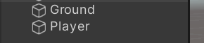
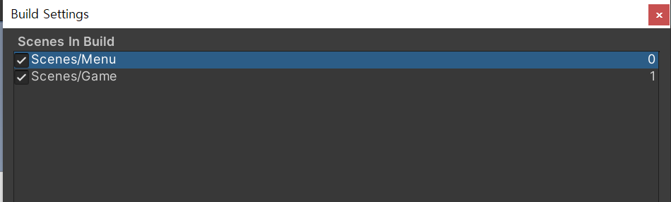

# 2020_Winter_Hae_U


## 2일차 : 서버개발(★Photon Bolt★)


### 포톤(Photon이란?)

>   Photon Unity Networking (PUN)은 멀티플레이어 게임용 유니티 패키지
>   3가지로 분류

## Photon Pun, Bolt, Quantum


>   
>   
>   

### 포톤 Bolt
>   

### 포톤 Quantum

>   
>   
## Quantum vs Bolt
>   
>   


## 이번 강의에서는 Photon Bolt를 사용
>   인터넷 상에도 자료가 많지 않아, 배우는데 어려움이 있을 수 있음

## 왜 Bolt를 사용하는가?

>   어렵지만 **확실히** 더 빠르다.

>   
>   
# PUN
>   코드가 쉬워 입문에 좋다.
>   RPC를 활용하여 매우 쉽게 코딩할 수 있다.
>   10인 이하 게임은 PUN2가 편하다.

# BOLT
>   P2P와 이벤트 기반이라 성능이 좋고 빠르다.
>   BoltEntity로 코드 작성없이 변수 동기화가 된다. (Interface 구현되어있음)
>   성능이 PUN보다 좋다. (물론 단점도 있다.)

## 서버와 클라이언트 구조 및 원리

>   한 사람이 <세션이름>으로 호스트(서버를 염)
> 다른 사람들은 클라이언트 접속하면 세션 목록들이 나오니, 그중 한 <세션 이름> 으로 클라이언트로서 참가하면 됨

### Bolt 관련 함수 예제 코드


```c#
using Bolt.Matchmaking;
using UnityEngine.UI;
using UdpKit;

public class LobbyManager : Bolt.GlobalEventListener
{
    public Text LogText;
    public InputField SessionInput;

    public void BoltConnection(){
        //서버열기
        BoltLauncher.StartServer();
        //클라이언트로 열기
        BoltLauncher.StartClient();
        //싱글플레이로 열기
        BoltLauncher.StartSinglePlayer();
        //서버 닫기
        BoltLauncher.Shutdown();


        //세션 만들기(호스트)
        BoltMatchmaking.CreateSession(SessionInput.text, sceneToLoad : "GameScene");
        //세션 참가하기(클라이언트)
        BoltMatchmaking.JoinSession(SessionInput.text);
        //세션 랜덤 참가하기(클라이언트)
        BoltMatchmaking.JoinRandomSession();
    }

}
```

### 클라이언트 접속시 세션 목록이 보입니다. (자동 업데이트)

#### 아래 함수(SessionListUpdated)는 서버에 참가할 때, 접속 종료할 때, 그리고 매 초마다 실행됩니다.
```c#
public override void SessionListUpdated(Map<System.Guid, UdpSession> sessionList){
    string log = "";
    foreach(var session in sessionList){
        UdpSession photonSession = session.Value;
        if(photonSession.Source == UdpSessionSource.Photon){
            log += $"{photonSession.HostName}";
        }
        LogText.text = log;
    }
}
```

### 함수 사용법이 기존과 조금 다릅니다.

>   Object 생성함수는 Instantiate (기존)
>   BoltNetwork.Instantiate (Bolt 함수)

### Bolt 탭의 Assets (중요)

>   

#### 볼트를 하는데 매우 많이 사용됩니다. -> 모든 동기화 상태나 이벤트를 관리하는 역할을 합니다.

##### Ctrl키를 누르면 Assets내의 속성들을 지울 수 있습니다.

>   

#### Local과 Remote의 개념
>   


### Bolt의 특별함수

```c#

//start함수와 원리는 같지만, 자기자신만 실행
public override void Attached(){

}


```
위 코드는 아래 코드와 같습니다.

```c#
public void Update(){
    if(!entity.isOwner) return;

}
```

#### 마찬가지로, Update함수도 Bolt만의 Function이 있습니다.

```c#
public override void SimulateOwner(){

}
```

# -실습-

## Photon Bolt 설치

>   
>   
>   

이후, 유니티 Assets 폴더에 다음과 같이 3가지 폴더가 생겼습니다.

>   

Cube와 Plane을 생성하고, Cube는 Player로, Plane은 Ground로 이름을 변경합니다.
>   
>   

바닥의 색상이 조금 밋밋하니, 새로운 머테리얼을 생성해 Ground에 입혀줍니다.

>   

MainCamera를 다음과 같이 전 바닥이 잘 보이게 설정해줍니다.

>   

Prefebs 폴더를 만들고, 폴더 안에 Cube를 넣어줘서 Prefeb화 시켜줍니다.

Bolt Assets에 다음과 같이 **myCube** Entity를 추가해주고, transform 속성을 추가해줍니다.

'smoothing algorithm' 옵션은 Interpolation으로 지정해줍니다.
>   

이후, Compile Assembly와, Bolt Prefeb을 Update 시켜줍니다.

-> Bolt가 Cube Prefeb을 알게되고, 동기화할 준비가 되게 하는 과정입니다.


방금 만든 Scene은 Game 내부 Scene입니다.

저희는 서버를 먼저 구현할 것이기 때문에, 이 Scene은 이후에 다뤄보도록 하겠습니다.

새로운 Scene을 만들어 Photon Bolt 기반의서버를 구현해보겠습니다.

이 Scene을 저장하고 **Game** 으로 이름을 변경해줍니다.

새로운 Scene을 만들고 **Menu**라고 이름을 변경합니다.

>   


Menu Scnen으로 가서 패널 안에 Button을 두개 만들고 크기 / 위치 / 이름을 다음 그림과 같이 변경해줍니다.

>   

Scripts 폴더를 생성하고, 안에 **Menu**스크립트를 생성해줍니다.
>   

다음 코드를 작성해줍니다.

```c#
using System.Collections;
using System.Collections.Generic;
using UnityEngine;
using UnityEngine.UI;

using Bolt;
using Bolt.Matchmaking;
using UdpKit;
using System;

public class Menu : GlobalEventListener
{
    public void StartServer()
    {
        BoltLauncher.StartServer();
    }

    public override void BoltStartDone()
    {
        BoltMatchmaking.CreateSession(sessionID: "test", sceneToLoad: "Game");
    }

    public void StartClient()
    {
        BoltLauncher.StartClient();
    }

    //called when a room is created or destroyed, as well as every few seconds
    public override void SessionListUpdated(Map<Guid, UdpSession> sessionList)
    {
        foreach (var session in sessionList)
        {
            UdpSession photonSession = session.Value as UdpSession;

            if (photonSession.Source == UdpSessionSource.Photon)
            {
                BoltMatchmaking.JoinSession(photonSession);
            }
        }
    }
}


```

이후 스크립트를 EventSystem에 넣어준 후,

>   **호스트** 버튼에는 스크립트의 StartServer 메서드를 넣어주고,

>   **접속** 버튼에는 스크립트의 StartClient 메서드를 넣어줍니다.

다음 코드를 작성하고, **Menu** Scene의 EventManager에 넣어줍니다.

**Game** Scene으로 넘어가면, 큐브가 생성이 되게 다음과 같이 스크립트를 작성합니다.

NetworkCallBacks.cs
```c#
using System.Collections;
using System.Collections.Generic;
using UnityEngine;
using Bolt;

public class NetworkCallbacks : GlobalEventListener
{
    public GameObject cubePrefeb;

    public override void SceneLoadLocalBegin(string scene)
    {
        Debug.Log("큐브 생성!");
        var Pos = new Vector3(Random.Range(0, 2), 1, Random.Range(0, 2));
        BoltNetwork.Instantiate(BoltPrefabs.Player, Pos, Quaternion.identity);
    }
}
```

이후, 아래처럼 Scene 2개를 순서에 맞게 넣어줍니다.
>   

CTRL+B 단축키를 이용해 Build를 한 후, 서버와 클라이언트가 잘 작동하는지 확인합니다.

Build 하기 전, Player Setting에 Fullscreen Mode의 값을 Windowded로 바꿔주면 창모드로 실행됩니다.

>   


다음과 같이 2개를 실행시켜놓고, 실행하면 정상적으로 동기화되어 표시되는 것을 확인할 수 있습니다.

>   


플레이어가 움직이는 스크립트까지 구현해보겠습니다.

Scripts 폴더에 **PlayerMove.cs** 스크립트를 생성해주시고, 다음과 같이 코드를 입력합니다.

```c#
using System.Collections;
using System.Collections.Generic;
using UnityEngine;
using Bolt;

public class PlayerMove : Bolt.EntityBehaviour<ImyCube>
{
    private float h;
    private float v;
    private float player_speed = 5.0f;

    public override void Attached()
    {
        state.SetTransforms(state.myCube_Transform, transform);
    }

    public void Update()
    {
        if (!entity.IsOwner)
        {
            return;
        }

        h = Input.GetAxis("Horizontal");
        v = Input.GetAxis("Vertical");

        this.transform.Translate(new Vector3(h, 0, v) * player_speed * BoltNetwork.FrameDeltaTime);
    }

}

```

Player Prefeb 에게 Script를 넣어주고 빌드하여 잘 움직이는지 확인해봅시다!

>   
