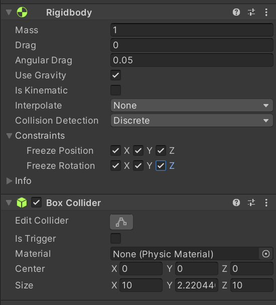

# 2020_Winter_Hae_U

-> 여러 게임 요소들을 추가해보자

## 점프하기

플레이어 스크립트를 다음과 같이 작성했었습니다.

```c#
using System.Collections;
using System.Collections.Generic;
using UnityEngine;
using Bolt;

public class PlayerMove : Bolt.EntityBehaviour<ImyCube>
{
    private float h;
    private float v;
    private float player_speed = 5.0f;

    public override void Attached()
    {
        state.SetTransforms(state.myCube_Transform, transform);
    }

    public void Update()
    {
        if (!entity.IsOwner)
        {
            return;
        }

        h = Input.GetAxis("Horizontal");
        v = Input.GetAxis("Vertical");

        this.transform.Translate(new Vector3(h, 0, v) * player_speed * BoltNetwork.FrameDeltaTime);
    }

}

```

이를 좀 더 보기 간단하게 하기 위해 **추상화**시킵니다.

Update 함수 안의 플레이어가 움직이는 부분을 Move()메서드를 만들어서 밖으로 꺼내줍니다.

```c#
using System.Collections;
using System.Collections.Generic;
using UnityEngine;
using Bolt;

public class PlayerMove : Bolt.EntityBehaviour<ImyCube>
{
    private float h;
    private float v;
    private float player_speed = 5.0f;

    public override void Attached()
    {
        state.SetTransforms(state.myCube_Transform, transform);
    }

    public void Update()
    {
        if (!entity.IsOwner)
        {
            return;
        }

        Move();
        
    }

    void Move()
    {
        h = Input.GetAxis("Horizontal");
        v = Input.GetAxis("Vertical");

        this.transform.Translate(new Vector3(h, 0, v) * player_speed * BoltNetwork.FrameDeltaTime);
    }

}

```

이는 꽤 중요한 사항으로서, 코드가 길어지고 프로젝트가 커질 수록 코드가 보기 힘들어지기 때문에,

코드를 추상화시키는 것은 **필수 사항**이라고 생각합니다.

Jump()메서드를 마찬가지로 만들어서 안에 내용을 작성해보겠습니다.

점프할 때, 우선 위로 힘을 줄것입니다. -> Transform.Translate 함수를 쓰지 않고, rigidBody Component에 Addforce 메서드를 사용하여 위쪽으로 순간적으로 힘을 주는 방식을 채택할 것입니다.

rigidbody 속성이 있어야하고, 땅과 부딪혀야 하기 때문에, Ground와 Player에게 rigidbody와 collider를 추가해줍니다.

>   Ground Component  
>   

>   Player Component  
>   

오브젝트의 Rigidbody 속성을 가져오기 위해, 다음과 같이 정의합니다.

```c#
private Rigidbody rigid;

    public override void Attached()
    {
        rigid = this.gameObject.GetComponent<Rigidbody>();
    }
```

Jump()메서드에 다음과 같이 정의합니다.

->space를 누르면 위로 힘을 가한다.(addforce메서드를 실행한다.)

```c#
void Jump()
    {
        if (Input.GetKey(KeyCode.Space))
        {
            rigid.AddForce(Vector3.up * jumpPower, ForceMode.Impulse);
        }
        
    }
```

하지만 생각하지 못했던 점이 있습니다.

스페이스를 누를 때 마다 위쪽으로 힘이 가해져서 끝도없이 올라가게 됩니다.

따라서 isjumping이라는 bool형 변수를 하나 추가하여

isjumping == true 이면 addforce메서드를 실행할 수 없게 코드를 수정합니다.

Ground와 부딪힐 때 isjumping을 false로 해줍니다.

Ground Tag를 "ground"로 지정해줍니다.

>   


충돌함수는 다음과 같습니다.

```c#
private void OnCollisionEnter(Collision collision)
    {
        if (collision.gameObject.CompareTag("ground"))
        {
            isjumping = false;
        }
    }
```

Jump()메서드를 다음과 같이 수정해줍니다.

```c#
void Jump()
    {
        if (Input.GetKey(KeyCode.Space) && isjumping == false)
        {
            rigid.AddForce(Vector3.up * jumpPower, ForceMode.Impulse);
            isjumping = true;
        }
        
    }
```

이로서 총 PlayerMove.cs 스크립트는 다음과 같습니다.

```c#
using System.Collections;
using System.Collections.Generic;
using UnityEngine;
using Bolt;

public class PlayerMove : Bolt.EntityBehaviour<ImyCube>
{
    private float h;
    private float v;
    private float player_speed = 5.0f;
    private float jumpPower = 5.0f;
    private bool isjumping = false;

    private Rigidbody rigid;

    public override void Attached()
    {
        rigid = this.gameObject.GetComponent<Rigidbody>();
        state.SetTransforms(state.myCube_Transform, transform);
    }

    public void Update()
    {
        if (!entity.IsOwner)
        {
            return;
        }

        Move();
        Jump();
        
    }

    void Jump()
    {
        if (Input.GetKey(KeyCode.Space) && isjumping == false)
        {
            rigid.AddForce(Vector3.up * jumpPower, ForceMode.Impulse);
            isjumping = true;
        }
        
    }

    void Move()
    {
        h = Input.GetAxis("Horizontal");
        v = Input.GetAxis("Vertical");

        this.transform.Translate(new Vector3(h, 0, v) * player_speed * BoltNetwork.FrameDeltaTime);
    }

    private void OnCollisionEnter(Collision collision)
    {
        if (collision.gameObject.CompareTag("ground"))
        {
            isjumping = false;
        }
    }

}

```

#### Jump 구현 완료!

>   

## Player를 따라가는 Camera

Player Prefeb 안에 camera를 하나 만들어줍니다.

위치 조정 또한 해줍니다.


>   

player_Camera 오브젝트를 꺼주고, 스크립트로서 켜주게 하겠습니다.

PlayerMove.cs 스크립트를 다음과 같이 수정해줍니다.

```c#
public Camera player_cam;

    public override void Attached()
    {
        rigid = this.gameObject.GetComponent<Rigidbody>();
        state.SetTransforms(state.myCube_Transform, transform);

        if (entity.IsOwner)
        {
           player_cam.gameObject.SetActive(true);
        }
    }
```

이후 player_Camera 오브젝트를 player_cam 변수에 Inspector창에 Drag & Drop 방식으로 할당해줍니다.

잘 작동되는지 빌드하여 확인해봅니다.

>   

카메라가 자신의 Cube를 잘 따라가는 것을 확인할 수 있습니다.

## Player 닉네임 설정 (Cube위에 표시)

**Menu** Scene으로 이동합니다.  

MenuPanel을 꺼주고, 다음과 같이 NickNamePanel을 구성해줍니다.  
>   

Nickname은 BoltEntity의 String 속성을 추가하여 Nickname변수에 저장하겠습니다.  

>   

>   이후, Compile Assembly를 클릭해주어 Bolt 컴파일 해주는 것을 잊지맙시다!


닉네임과 관련된 스크립트는 **NickName.cs** 스크립트를 새로 만들어서 작성해주겠습니다.

TEXT 오브젝트 값을 변경하기 위해 다음과 같이 using UnityEngine.UI; 코드를 추가해줍니다.  
```C#
using UnityEngine.UI;
```

이후 NickName.cs스크립트는 다음과 같습니다.

```c#
using System.Collections;
using System.Collections.Generic;
using UnityEngine;
using UnityEngine.UI;

public class NickName : Bolt.EntityBehaviour<ImyCube>
{
    private Text Nickname_Text;
    public GameObject player;

    private void Start()
    {
        Nickname_Text = this.GetComponent<Text>();
        Nickname_Text.text = player.GetComponent<BoltEntity>().GetState<ImyCube>()._Nickname;
    }
}

```

Player prefeb 내에서 text 오브젝트를 생성하여 플레이어 위에 잘 보이게 설정해줍니다.

>   

이 text 오브젝트에 NickName 스크립트를 적용해줍니다.

Menu 스크립트에 다음 코드를 추가해줍니다.

```c#
public void OnValueChange(string input)
{
    PlayerPrefs.SetString("username", input);
}
```

위 함수는 InputField 칸에 적용시킬 함수입니다. InputField에 값이 매번 바뀔 때마다 PlayerPrefs 위 **username** 변수에 그 내용이 할당됩니다.

NickName.cs 코드를 수정해줍니다.

```c#
using System.Collections;
using System.Collections.Generic;
using UnityEngine;
using UnityEngine.UI;

public class NickName : Bolt.EntityBehaviour<ImyCube>
{
    private Text Nickname_Text;
    public GameObject player;

    private void Start()
    {
        Nickname_Text = this.GetComponent<Text>();
        if (entity.IsOwner)
        {
            entity.GetState<ImyCube>()._Nickname = PlayerPrefs.GetString("username");
        }
        
        Nickname_Text.text = player.GetComponent<BoltEntity>().GetState<ImyCube>()._Nickname;
    }
}

```

NickNamePanel에 OK 버튼에 다음과 같이 설정해줍니다.


>   

이후, 플레이어 위에 닉네임이 잘 표시되는지 확인합니다.

>   


##  **혹시 오류가 뜬다면 Bolt 컴파일을 했는지 다시 한번 확인해봅니다!**


# 3D 모델 입히기 / 애니메이션 적용


에셋 스토어의 'RPG Monster Duo PBR Polyart'라는 Free assets을 사용하겠습니다.  

>   


다운로드 후 유니티에 Import합니다.  

>   

위처럼 폴더가 Import됩니다.

현재 만들어놓은 Player instance와 바꾸고 싶은 모델의 Instance를 다음과 같이 띄워줍니다.

>   

저는 'TurtleShell'로 하겠습니다.

TurtleShell의 prefeb안에 Body와 TurtleShell 오브젝트가 자식으로 있는 것을 확인할 수 있습니다.

이 2개를 Player 안에 넣어주겠습니다.

>   

Body와 TurtleSheel의 위치를 큐브 위치에 맞춰주고, Player의 Mesh Renderer 속성을 체크해제합니다. (Cube를 눈에서 지우기 위해)
>   

이제 Animator를 만들어보겠습니다.


Animations 폴더를 만들고, 안에 Player라는 Animator Controller를 만들어줍니다.

>   

Animator를 더블클릭하면 다음과 같이 나오게됩니다.

>   

Animator란, Animation들을 제어하는 상위개념으로, 여러 Animation들간에 이동 조건을 지정해주며 전체적인 제어를 담당합니다.

가져온 3D 오픈 소스의 Animation폴더안의 **IdleNormal** 과 **WalkFWD** 이 두개의 Animation을 Animator에 Drag & Drop으로 추가해줍니다.

>   

이 두개의 애니메이션들간의 변화 조건을 지정해주고, 이동할 수 있게 하기 위해 Transition을 쌍방향으로 추가해줍니다.

그리고 즉각적인 Animation 변화를 위해 다음과 같이 설정합니다.


>   
> 
>   Has Exit Time -> 체크해제
>   Transition Duration -> 0
>   Transition Offset -> 0

bool형 "walk" 파라미터를 추가하고, transition에 Conditions 부분에 다음과같이 추가합니다.

>      
> 
>   walk가 true일 경우 idleNormal에서 WalkFWD로 전환됩니다.
> 
>   반대로 walk가 false일 경우 그 반대로 전환됩니다.


<이 walk 변수는 local에서 수정하면 안되고, bolt로 동기화 시켜야 합니다. 그렇지 않으면 다른 플레이어가 animation을 수행하지 못합니다.>


Player에 Animator 속성을 추가해주고, 만든 Animation을 할당해줍니다.

>      

Bolt Asset에 들어가서, Player Animator를 Import Mecanim Parameters에 넣어주고, 옆의 Import 버튼을 눌러주면 walk 변수가 아래에 추가되게 됩니다.

이로서 Bolt 동기화 준비는 완료된 것입니다.

>   


다음은 walk변수를 스크립트로서 제어하겠습니다.

playerMove 스크립트에 들어가서 다음과 같이 수정해줍니다.

```c#
using System.Collections;
using System.Collections.Generic;
using UnityEngine;
using Bolt;

public class PlayerMove : Bolt.EntityBehaviour<ImyCube>
{
    private float h;
    private float v;
    private float player_speed = 5.0f;
    private float jumpPower = 5.0f;
    private bool isjumping = false;

    private Rigidbody rigid;

    public Camera player_cam;

    public Animator animator;

    public override void Attached()
    {
        rigid = this.gameObject.GetComponent<Rigidbody>();
        state.SetTransforms(state.myCube_Transform, transform);
        if (entity.IsOwner)
        {
           player_cam.gameObject.SetActive(true);
        }

        state.SetAnimator(animator);
    }

    public void Update()
    {
        if (!entity.IsOwner)
        {
            return;
        }

        Move();
        Jump();
        
    }

    void Jump()
    {
        if (Input.GetKey(KeyCode.Space) && isjumping == false)
        {
            rigid.AddForce(Vector3.up * jumpPower, ForceMode.Impulse);
            isjumping = true;
        }
        
    }

    void Move()
    {
        h = Input.GetAxis("Horizontal");
        v = Input.GetAxis("Vertical");

        this.transform.Translate(new Vector3(h, 0, v) * player_speed * BoltNetwork.FrameDeltaTime);

        if(h == 0 && v == 0)
        {
            state.Animator.SetBool("walk", false);
        }
        else
        {
            state.Animator.SetBool("walk", true);
        }
    }

    private void OnCollisionEnter(Collision collision)
    {
        if (collision.gameObject.CompareTag("ground"))
        {
            isjumping = false;
        }
    }

}


```

player prefeb의 Inspector창에서 스크립트에 animator를 할당해줍니다. 

>   


이후 플레이어 프리펩을 override하고, bolt compile해줍니다.

>   

정상적으로 Animation이 잘 작동하는 것을 확인할 수 있습니다.


## Player 움직임 방향 바꾸기 / 관련 Camera 조정

Player를 움직이는 방향을 보게 만들고 싶습니다.

다음과 같이 코드를 수정해주면 됩니다.

**Move함수 수정**

```c#
void Move()
    {
        h = Input.GetAxis("Horizontal");
        v = Input.GetAxis("Vertical");

        dir = new Vector3(h, 0, v);

        if (h == 0 && v == 0)
        {
            state.Animator.SetBool("walk", false);
            
        }
        else
        {
            state.Animator.SetBool("walk", true);
            this.transform.rotation = Quaternion.LookRotation(dir);
            this.transform.Translate(Vector3.forward * player_speed * BoltNetwork.FrameDeltaTime);
        }
    }
```

하지만, 버그가 있습니다. Camera가 자식 오브젝트로 존재하기 때문에, 같이 회전이 되어버립니다.

카메라를 고정하는 스크립트를 새로 작성하여 Camera에 넣어주겠습니다.

코드는 다음과 같습니다.

```c#
using System.Collections;
using System.Collections.Generic;
using UnityEngine;

public class CameraController : MonoBehaviour
{
    public GameObject target;
    private Vector3 offset;
    private Vector3 offset_rot;

    private void Start()
    {
        offset = this.transform.position - target.transform.position;
        
    }

    private void Update()
    {
        this.transform.position = target.transform.position + offset;
        this.transform.eulerAngles = new Vector3(35, 0, 0);

    }
}

```

>   

이제 점점 게임이 되어가는 느낌을 받으시나요?
