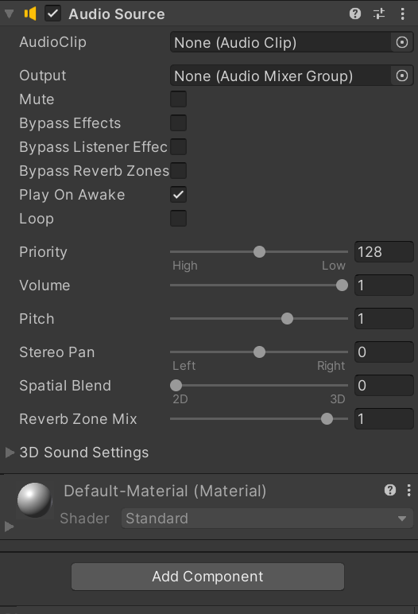
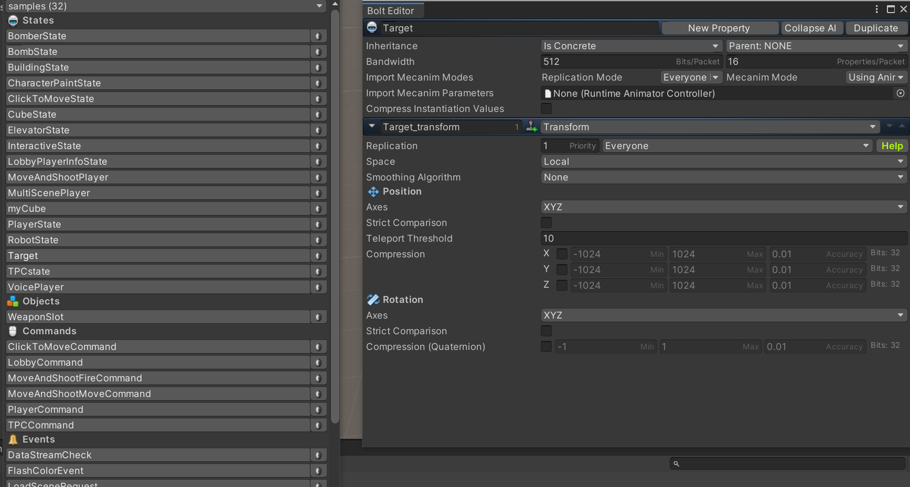
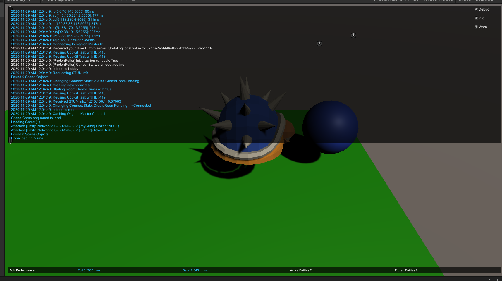
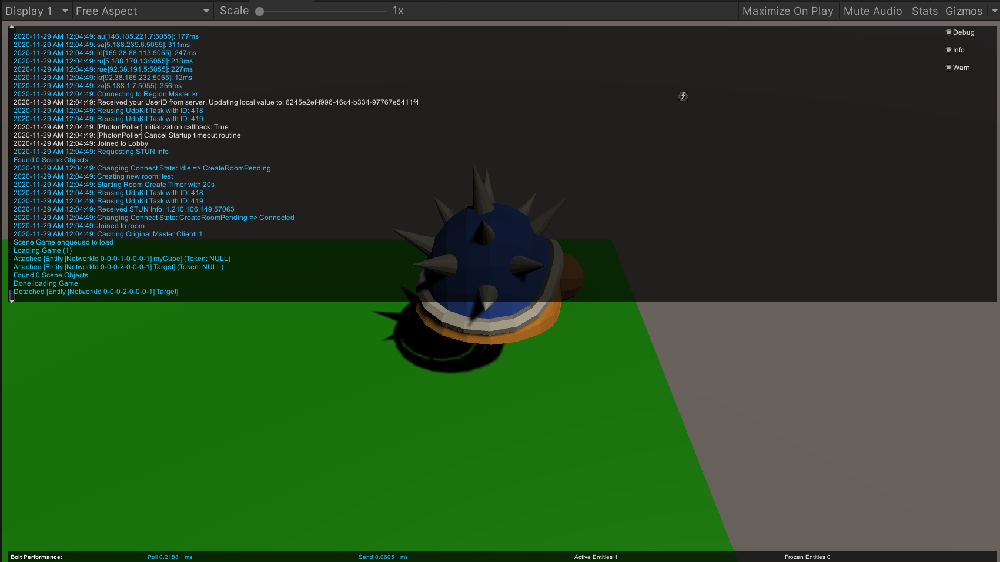

# 2020_Winter_Hae_U
2020_Winter_Hae_U


## 소리를 넣어보자!


>   유니티에서는 아주 간단한 방법으로 오디오 파일을 재생할 수 있는데, 오디오 재생에 필요한 요소는 단 두 가지로  AudioSource와 AudioListener입니다.  

Player Prefeb에 Audio Souce 속성을 넣어줍니다.

>   

속성에서 Player On Awake 부분의 체크를 해제합니다.

Player 스크립트를 다음과 같이 수정합니다.

```c#
public AudioSource audioSource;

    public override void Attached()
    {
        audioSource = GetComponent<AudioSource>();

        rigid = this.gameObject.GetComponent<Rigidbody>();
        state.SetTransforms(state.myCube_Transform, transform);
        if (entity.IsOwner)
        {
           player_cam.gameObject.SetActive(true);
        }

        state.SetAnimator(animator);
    }
```

Jump할 때 소리를 넣어보겠습니다.

```c#
void Jump()
    {
        if (Input.GetKey(KeyCode.Space) && isjumping == false)
        {
            audioSource.Play();
            rigid.AddForce(Vector3.up * jumpPower, ForceMode.Impulse);
            isjumping = true;
        }
        
    }
```


소리가 잘 나는 것을 확인합니다.

## 목표물 지정하기

Sphere(구)를 생성해주고, entity또한 다음과 같이 추가해줍니다.

>   

entity 이름은 **Target**으로 하겠습니다.

target 에 rigidbody와 collider를 추가해주고 Prefeb화 시킵니다.

**bolt compile을 빼먹지 마세요!**

Target 스크립트를 다음과 같이 작성하고 프리펩에 적용시킵니다.

```c#
using System.Collections;
using System.Collections.Generic;
using UnityEngine;

using Bolt;

public class Target : Bolt.EntityBehaviour<ITarget>
{
    public override void Attached()
    {
        state.SetTransforms(state.Target_transform, transform);
    }
    private void OnCollisionEnter(Collision collision)
    {
        if (collision.gameObject.CompareTag("Player"))
        {
            Debug.Log("collide!");
            entity.DestroyDelayed(0.0f);
        }
    }
}
```

이후, networkCallBack 스크립트에 한줄 추가하여 다음과 같이 만듭니다.

```c#
using System.Collections;
using System.Collections.Generic;
using UnityEngine;
using Bolt;

public class NetworkCallbacks : GlobalEventListener
{
    public GameObject cubePrefeb;

    public override void SceneLoadLocalBegin(string scene)
    {
        Debug.Log("큐브 생성!");
        var Pos = new Vector3(Random.Range(0, 2), 1, Random.Range(0, 2));
        BoltNetwork.Instantiate(BoltPrefabs.Player, Pos, Quaternion.identity)
        ;
        //타겟을 생성하는 위치는 임의로 정합니다. (원하는 위치로)
        BoltNetwork.Instantiate(BoltPrefabs.Target, new Vector3(3.84f, 0.883f, 2.43f), Quaternion.identity);
    }
}

```

게임을 플레이해보면서 이상한 부분이 없는지 검토합니다.


>   
>   

target 가까이로 가면 없어지는 것을 확인할 수 있습니다.

여기서, Target을 먹게되면 