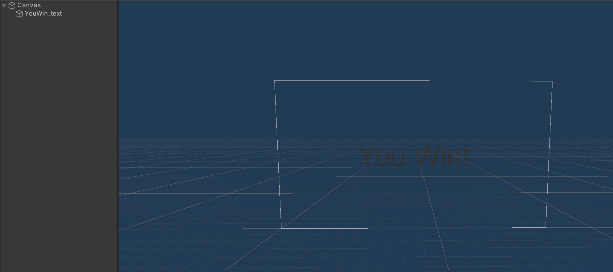
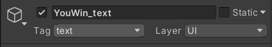
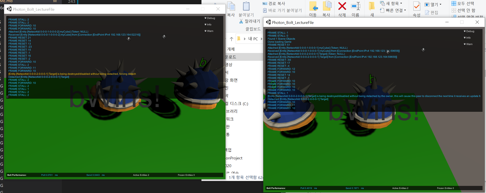
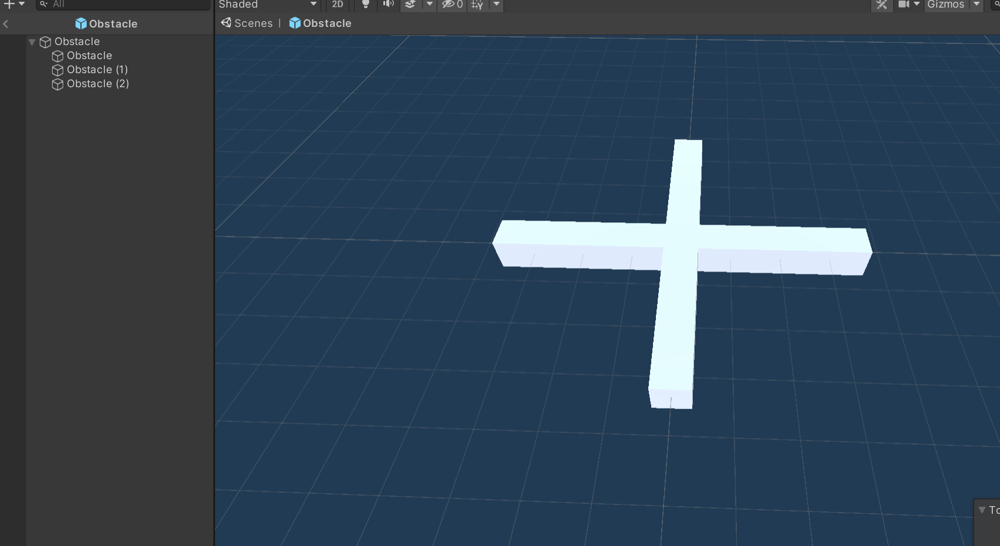
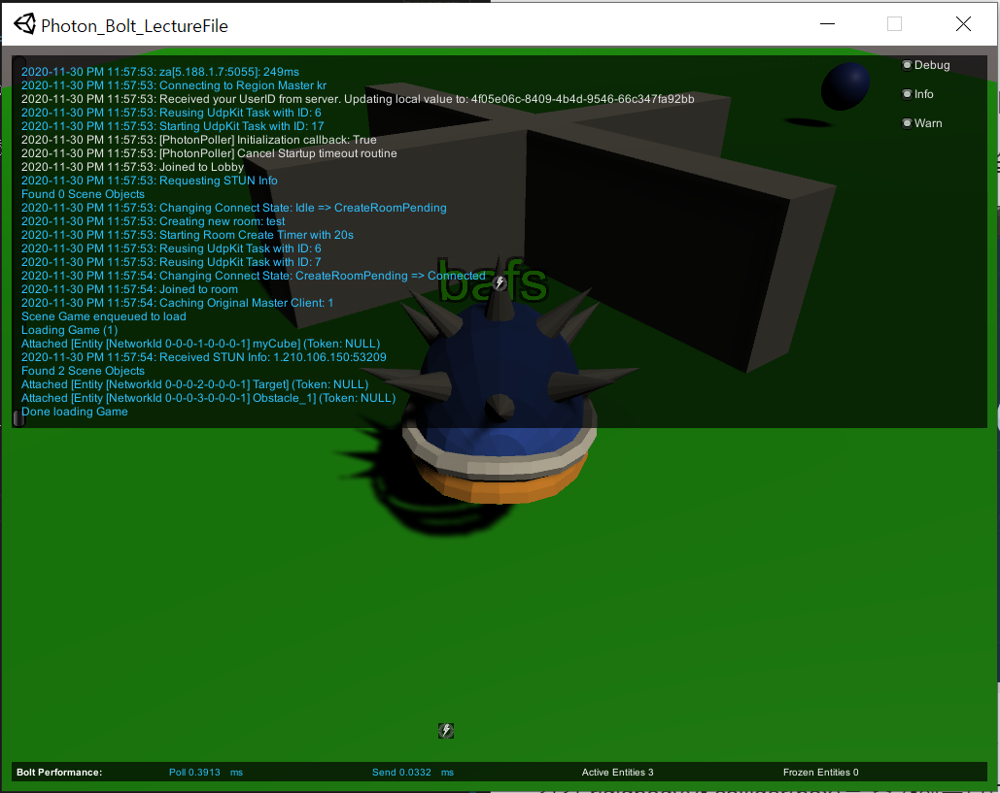
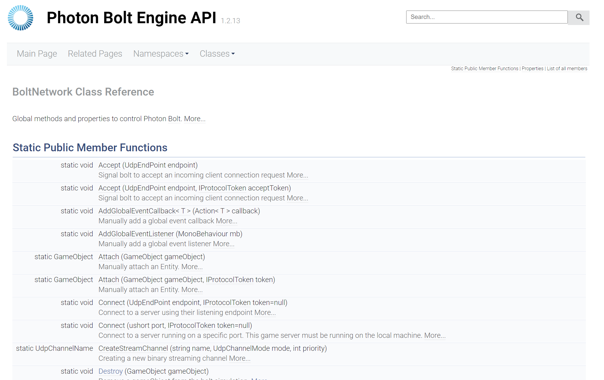
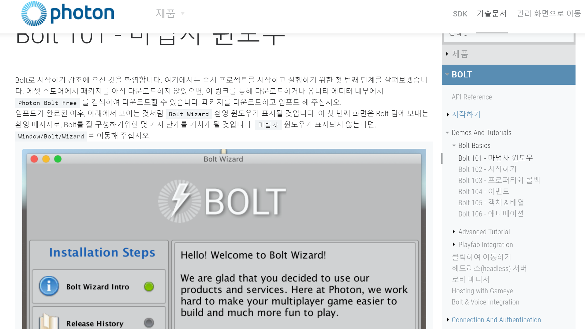

# 2020_Winter_Hae_U
2020_Winter_Hae_U


## 소리를 넣어보자!


>   유니티에서는 아주 간단한 방법으로 오디오 파일을 재생할 수 있는데, 오디오 재생에 필요한 요소는 단 두 가지로  AudioSource와 AudioListener입니다.  

Player Prefeb에 Audio Souce 속성을 넣어줍니다.

>   

속성에서 Player On Awake 부분의 체크를 해제합니다.

Player 스크립트를 다음과 같이 수정합니다.

```c#
public AudioSource audioSource;

    public override void Attached()
    {
        audioSource = GetComponent<AudioSource>();

        rigid = this.gameObject.GetComponent<Rigidbody>();
        state.SetTransforms(state.myCube_Transform, transform);
        if (entity.IsOwner)
        {
           player_cam.gameObject.SetActive(true);
        }

        state.SetAnimator(animator);
    }
```

Jump할 때 소리를 넣어보겠습니다.

```c#
void Jump()
    {
        if (Input.GetKey(KeyCode.Space) && isjumping == false)
        {
            audioSource.Play();
            rigid.AddForce(Vector3.up * jumpPower, ForceMode.Impulse);
            isjumping = true;
        }
        
    }
```


소리가 잘 나는 것을 확인합니다.

## 목표물 지정하기

Sphere(구)를 생성해주고, entity또한 다음과 같이 추가해줍니다.

>   

entity 이름은 **Target**으로 하겠습니다.

target 에 rigidbody와 collider를 추가해주고 Prefeb화 시킵니다.

**bolt compile을 빼먹지 마세요!**

Target 스크립트를 다음과 같이 작성하고 프리펩에 적용시킵니다.

```c#
using System.Collections;
using System.Collections.Generic;
using UnityEngine;

using Bolt;

public class Target : Bolt.EntityBehaviour<ITarget>
{
    public override void Attached()
    {
        state.SetTransforms(state.Target_transform, transform);
    }
    private void OnCollisionEnter(Collision collision)
    {
        if (collision.gameObject.CompareTag("Player"))
        {
            Debug.Log("collide!");
            entity.DestroyDelayed(0.0f);
        }
    }
}
```

이후, networkCallBack 스크립트에 한줄 추가하여 다음과 같이 만듭니다.

```c#
using System.Collections;
using System.Collections.Generic;
using UnityEngine;
using Bolt;

public class NetworkCallbacks : GlobalEventListener
{
    public GameObject cubePrefeb;

    public override void SceneLoadLocalBegin(string scene)
    {
        Debug.Log("큐브 생성!");
        var Pos = new Vector3(Random.Range(0, 2), 1, Random.Range(0, 2));
        BoltNetwork.Instantiate(BoltPrefabs.Player, Pos, Quaternion.identity)
        ;
        //타겟을 생성하는 위치는 임의로 정합니다. (원하는 위치로)
        BoltNetwork.Instantiate(BoltPrefabs.Target, new Vector3(3.84f, 0.883f, 2.43f), Quaternion.identity);
    }
}

```

게임을 플레이해보면서 이상한 부분이 없는지 검토합니다.


>   
>   

target 가까이로 가면 없어지는 것을 확인할 수 있습니다.

target을 먹으면 Win 문구가 화면에 뜨게 해보겠습니다.

다음과 같이 Text 오브젝트를 생성합니다.

Text 오브젝트의 이름은 'YouWin_text'라고 하겠습니다.

>   

이후 YouWin text의 tag를 text로 해줍니다. 이유는 이 텍스트를 태그로서 찾게 할 것이기 때문입니다. (FindWithTag 함수 사용)

>   

이후 최종 PlayerMove 스크립트는 다음과 같습니다.

```c#
using System.Collections;
using System.Collections.Generic;
using UnityEngine;
using UnityEngine.UI;
using Bolt;

public class PlayerMove : Bolt.EntityBehaviour<ImyCube>
{
    private float h;
    private float v;
    private float player_speed = 5.0f;
    private float jumpPower = 5.0f;
    private bool isjumping = false;

    public GameObject win_text;

    private Rigidbody rigid;
    private Vector3 dir;
    public Camera player_cam;

    public Animator animator;

    public AudioSource audioSource;

    public override void Attached()
    {
        audioSource = GetComponent<AudioSource>();
        
        rigid = this.gameObject.GetComponent<Rigidbody>();
        state.SetTransforms(state.myCube_Transform, transform);
        if (entity.IsOwner)
        {
           player_cam.gameObject.SetActive(true);
        }

        state.SetAnimator(animator);
    }

    public void Update()
    {
        if (!entity.IsOwner)
        {
            return;
        }

        Move();
        Jump();
        
    }

    void Jump()
    {
        if (Input.GetKey(KeyCode.Space) && isjumping == false)
        {
            audioSource.Play();
            rigid.AddForce(Vector3.up * jumpPower, ForceMode.Impulse);
            isjumping = true;
        }
        
    }

    void Move()
    {
        h = Input.GetAxis("Horizontal");
        v = Input.GetAxis("Vertical");

        dir = new Vector3(h, 0, v);

        

        /*
        this.transform.Translate(new Vector3(h, 0, v) * player_speed * BoltNetwork.FrameDeltaTime);
        */

        if (h == 0 && v == 0)
        {
            state.Animator.SetBool("walk", false);
            
        }
        else
        {
            state.Animator.SetBool("walk", true);
            this.transform.rotation = Quaternion.LookRotation(dir);
            this.transform.Translate(Vector3.forward * player_speed * BoltNetwork.FrameDeltaTime);
        }
    }

    private void OnCollisionEnter(Collision collision)
    {
        if (collision.gameObject.CompareTag("ground"))
        {
            isjumping = false;
        }

        if (collision.gameObject.CompareTag("target"))
        {
            GameObject.FindWithTag("text").GetComponent<Text>().text = entity.GetState<ImyCube>()._Nickname + "Wins!";
        }
    }

}

```

중요한 부분은 아랫줄 코드에

```c#
private void OnCollisionEnter(Collision collision)
    {
        if (collision.gameObject.CompareTag("ground"))
        {
            isjumping = false;
        }

        if (collision.gameObject.CompareTag("target"))
        {
            GameObject.FindWithTag("text").GetComponent<Text>().text = entity.GetState<ImyCube>()._Nickname + "Wins!";
        }
    }
```

부분입니다.

text라는 태그를 가진 오브젝트를 찾고 Text라는 속성을 받아오며, 그것의 텍스트를 ImyCube속성 중 _Nickname 값을 받아오고 그것에 Wins!를 붙이는 방법입니다.


>   

a와 b중 b가 Target을 먹었을 때, 화면에 **b Wins!**가 표시되는 것을 확인할 수 있습니다!

## 장애물을 만들어보자!

자기가 원하는 형태의 장애물을 만들어봅시다.

저는 회전하는 형태의 장애물을 만들어 보겠습니다.

>   

Obstacle 안에 3개의 Obstacle 오브젝트가 있습니다.

각각 rigidbody와 collider(box)를 추가해줍니다. (충돌을 해야하기 때문)

Obstacle.cs 스크립트를 만들고

위 Prefeb에 넣어줍니다.

```c#

```

이후 여러 함수를 활용하여 자신이 원하는 장애물을 여러개 만들어봅시다!

배운 Terrain과 Lighting 등 여러 요소들을 결합하여 자신만의 게임을 만들어 봅시다!


>   

### Server에 대한 기본적인 구현과 Object들의 동기화 및 Entity에 대한 전반적인 개념이 잡히셨나요?

### 이번 강의는 완벽한 게임을 만들기 보다는, Bolt라는 새로운 툴을 다루는 법을 배워보았습니다. 쉽지는 않았지만, 많은 도움이 됬을거라 믿어 의심치 않습니다!

### 다른 툴을 배우는데 있어서도 많은 도움이 될 것이고, 이렇게 천천히 여러분들의 경력을 쌓아가시기 바랍니다!

### 혹시 궁금한 점이 있으시면 gustngusrud1@naver.com로 연락주시기 바랍니다~

# 참조 사이트

Photon Bolt Engine API 설명

>   https://doc-api.photonengine.com/en/bolt/current/class_bolt_network.html

>   


Photon Bolt Demos and Tutorials

>   https://doc.photonengine.com/ko-kr/bolt/current/demos-and-tutorials/bolt-basics/bolt-101-wizard-setup
>   

Photon Bolt 참조 - 고라니 tv (Youtube) 
https://www.youtube.com/channel/UCqzWomWZKZUKOdT0sQdWFPQ