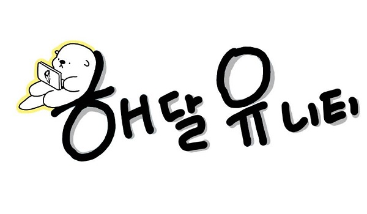
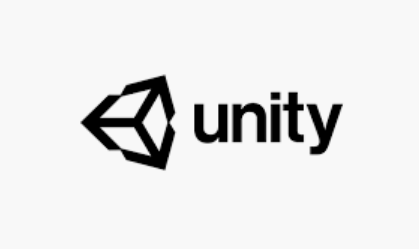

# 2020_Winter_Hae_U

## 메인강사 - 권현수   
## 보조강사 - 민시온   

# HAE-U
해달 + 유니티

경북대학교 IT대학 동아리 **해달**의 게임 개발 트랙  
유니티(게임엔진 프로그램)을 활용

# 트랙 정보
 
 * 처음 유니티를 접해보는 트랙원들을 위해 2~3주의 기초 유니티 사용법 강좌가 있습니다.
 
 플랫폼 게임 및 3D 멀티플레이 게임을 배워봅니다.
 
 * 게임 개발의 기초를 배우신 트랙원들은 3~4명씩 팀을 이루어 각자만의 게임장르, 게임개발 목표를 정합니다.
 * 이렇게 제작한 게임으로 **경북대학교 코드페어**나 기타 공모전에 참가하는 것이 최종 목표입니다.

[OT - 유니티 설치](Export-6e488096-b9e5-4cc8-867d-0c79d35cdff7/OT_81b96587fcb74b5e8a4027315c679d39.md)  

[1일차(12.18.금)](1일차(12.18.금)/README.md)   - Terrain등 유니티의 기본적인 요소를 배워보고 실습해봅니다.

[2일차(12.21.월)](2일차(12.21.월)/README.md)   - Photon Bolt를 이용하여 멀티플레이 서버를 공부해봅시다.

[3일차(12.22.화)](3일차(12.22.화)/README.md)   - Player를 멀티플레이어에 적용시켜보고, UI를 배우며, Animation을 적용해봅니다.

[4일차(12.23.수)](4일차(12.23.수)/README.md)   - 장애물을 여러개 만들어보고 자신만의 게임을 빌드해봅시다.

